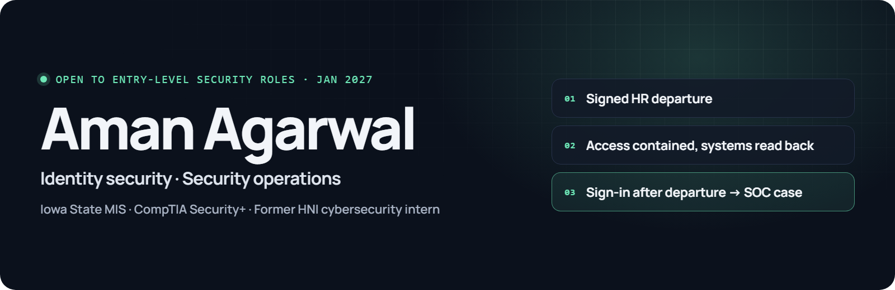
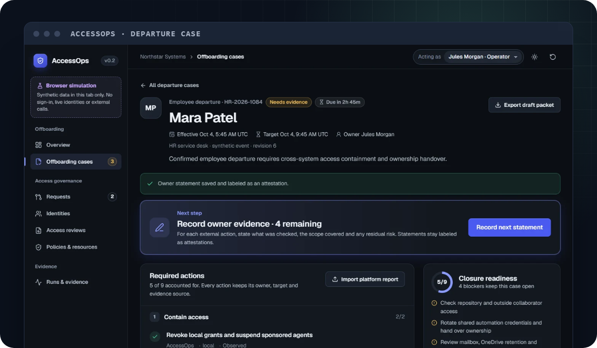
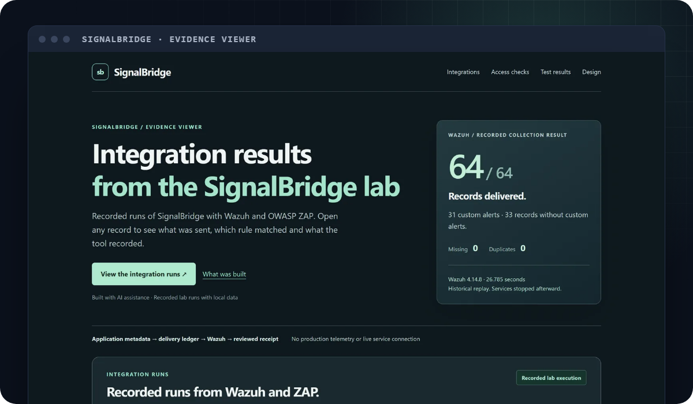

I build security controls and AI-powered tools, test them against real systems, and publish what failed alongside what passed. MIS senior at Iowa State with a Cybersecurity Engineering minor, graduating December 2026; CompTIA Security+; former cybersecurity intern at HNI. **Open to entry-level roles in security engineering, security operations or identity and access management, and AI engineering or automation roles, from January 2027.**

**[Portfolio](https://aman-agarwal6.github.io/)** · [Recruiter summary](https://aman-agarwal6.github.io/overview.html) · [LinkedIn](https://www.linkedin.com/in/aman-agarwal6/) · [Email](mailto:aagarwalcollege@gmail.com)

## Featured projects

<table>
<tr>
<td width="50%" valign="top">

### [AccessOps](https://aman-agarwal6.github.io/projects/accessops.html)

**Disabled isn't done.** Automated employee offboarding that proves the person's access is really gone. An HR event shuts off their access in Microsoft Entra ID, Keycloak and an Active Directory-compatible directory, and each system is checked to confirm the change.

- **2.6 s** from the HR event to the person signed out and their tokens blocked
- **6** gaps found by live testing, each fixed or documented
- **20 s** for Microsoft Entra ID to confirm the change, in a test tenant

[Case study](https://aman-agarwal6.github.io/projects/accessops.html) · [Live demo](https://aman-agarwal6.github.io/AccessOps/) · [Source](https://github.com/aman-agarwal6/AccessOps)

</td>
<td width="50%" valign="top">

### [SignalBridge](https://aman-agarwal6.github.io/projects/signalbridge.html)

**Catch the access that should have ended.** A detection lab where five detection rules, also written as Sigma, SPL and KQL, flag access that continues after a permission was removed. Tested against real Keycloak, Wazuh, OWASP ZAP and Shuffle.

- **4** writes a removed user could still make, until I found and fixed the race
- **5** detection rules run in Splunk and a Kusto emulator against the same 48 scenarios
- **0** events lost or duplicated when I stopped the Wazuh collector mid-run

[Case study](https://aman-agarwal6.github.io/projects/signalbridge.html) · [Source](https://github.com/aman-agarwal6/signalbridge)

</td>
</tr>
</table>

The two work as a pair: AccessOps sends a signed event for each offboarding step, and SignalBridge verifies those events and opens a critical case if a departed account is used anyway.

## More projects

| Project | What it is | Highlight |
| --- | --- | --- |
| [BetTail](https://aman-agarwal6.github.io/projects/bettail.html) | Live web app where private groups share sports picks and track results | Profit, ROI and leaderboards calculated in the database; row-level security on every exposed table; 6 fixes from my security review |
| [Netted](https://aman-agarwal6.github.io/projects/netted.html) | Personal-finance app for trade profit, shared funds and budgeting | Accounting rules written before any code; MFA enforced in the database; 7-item risk register |
| [Downfield](https://aman-agarwal6.github.io/projects/downfield.html) | Local AI research agent that writes structured NFL reports for BetTail | 32 games across two NFL weeks and 415 saved reports so far; every report checked by code; forecasts graded after each game |

BetTail, Netted and Downfield are private; their case studies link [selected code and tests](https://github.com/aman-agarwal6/aman-agarwal6.github.io/blob/main/docs/PROJECTS.md).

## Experience

**Cybersecurity Intern, HNI Corporation** · May–July 2026  
Automated triage for 3 identity-alert types in **Cortex XSIAM** (30+ alerts handled without manual review), supported phishing response and data-loss investigations with Proofpoint, built Python threat-intelligence integrations, and wrote Rego controls and Wiz queries for Azure.

## Toolkit

**Identity & access**  
    

**Detection & response**  
        

**Cloud security**  
  

**Engineering**  
       

**Delivery**  
  

**Applied AI**  
   
